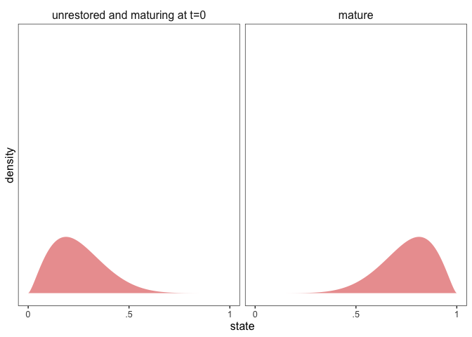
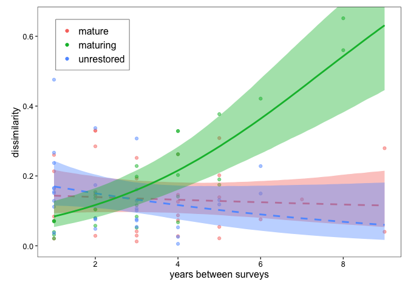
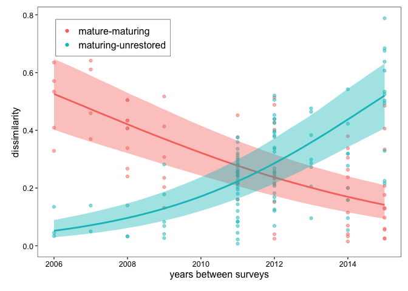

# ecology-species-composition

<!-- badges: start -->
<!-- badges: end -->

This repository describes how to run the models used in the manuscript
*Changes in species composition and community structure during
plant-pollinator community assembly* by Palumbo Gaiarsa et. al.

## Comparing network dissimilarity metrics

The underlying models for Figures 2 and 3 of the manuscript are the
same, and here we will demonstrate how to sample them using
[brms](https://paulbuerkner.com/brms/).

### Generate data

The data used for the models is generated by analyzing many
plant-pollinator networks with
[muritz](https://github.com/stoufferlab/muritz). To showcase the
functionality of the models, however, we will here use simulated data
instead.

The first models analyse different network dissimilarity metrics within
sites and between treatments. We will assume a Clementsian view of
community ecology, where maturing communities progress towards a optimum
community structure. Therefore, we will generate three types of
communities: 10 mature communities, already at the optimum state; 10
maturing communities, progressing towards the optimum state over time;
and, 10 unrestored communities, which should resemble maturing
communities at time $t=2006$. For each of this communities, we will
assume we have 3 time points measures sometime between 2006 and 2015.

``` r
library(dplyr)

n <- 10
nt <- 3
mu_ <- c(0.25, 0.75)

d <- data.frame(treatment = c(rep("mature", n), rep("maturing", n), rep("unrestored", n)),
                site = paste0("site", 1:(n*3))) %>%
  group_by(treatment, site) %>%
  reframe(time = sort(sample(2006:2015, replace = F, size = nt)))
```

Now, we will assume that the state of a community is defined by a
one-dimensional variable with values between 0 and 1, where the mature
optimum state falls somewhere around 0.75, the unrestored state fall
somewhere around 0.25, and the maturing communities resemble unrestored
communities at $t=2006$ and mature communities at $2015$. For example,
the distributions for the state of the different communities could look
something like:

``` r
library(ggplot2)
library(tidyr)
source("code/utility.R")

phi <- 10
crossing(mu = mu_) %>% 
  expand(nesting(mu),
         beta = seq(from = .001, to = .999, length.out = 300)) %>%
  mutate(d   = dbeta(beta, shape1 = mu * phi, shape2 = phi - (mu * phi))) %>%
  ungroup() %>%
  mutate(mu = factor(mu,
                      levels = mu_,
                      labels = c("unrestored and maturing at t=0", "mature"))) %>%
  ggplot(aes(x = beta, y = d)) +
  geom_area(fill = "#d73027", alpha = 0.5) +
  scale_x_continuous(breaks = 0:2 / 2, labels = c("0", ".5", "1")) +
  scale_y_continuous("density", breaks = NULL) +
  coord_cartesian(ylim = c(0, 14)) +
  xlab("state") +
  facet_grid(~ mu) +
  theme_bw() +
  theme(panel.grid = element_blank(), 
        text = element_text(size=fontsize),
        strip.background = element_blank(),
        strip.text = element_text(size = fontsize))
```



Based on this, we can now generate the values for the mature communities
(fluctuating around the optimal state), the values for unrestored
communities (fluctuating around their unrestored state), and the values
for maturing communities at t=2006 and t=2015.

``` r

d <- d %>%
  group_by(site) %>%
  mutate(state2006 = case_when(
    treatment == "maturing" ~ rbeta(1, shape1 = mu_[1] * phi, shape2 = phi - (mu_[1] * phi)),
    TRUE ~ NA
  )) %>%
  mutate(state2015 = case_when(
    treatment == "maturing" ~ rbeta(1, shape1 = mu_[2] * phi, shape2 = phi - (mu_[2] * phi)),
    TRUE ~ NA
  )) %>%
  ungroup() %>% rowwise() %>%
  mutate(state = case_when(
    treatment == "maturing" ~ state2006 + (state2015-state2006)*(time-2006)/(2015-2006),
    treatment == "unrestored" ~ rbeta(1, shape1 = mu_[1] * phi, shape2 = phi - (mu_[1] * phi)),
    treatment == "mature" ~ rbeta(1, shape1 = mu_[2] * phi, shape2 = phi - (mu_[2] * phi))
  )) %>% dplyr::select(treatment, site, time, state)
```

Finally, a convenient table to estimate the dissimilarity between any
two time points is a table with every combination of site-time points.

``` r

cbn <- combn(1:nrow(d),2)

dissimilarity <- cbind(
  d[cbn[1,],] %>% rename_at(vars(colnames(d)), ~ paste0(colnames(d), "A")),
  d[cbn[2,],] %>% rename_at(vars(colnames(d)), ~ paste0(colnames(d), "B"))
) %>%
  mutate(dissimilarity = abs(stateA-stateB))
```

### Within site

Once we have the data, we need to prepare it for the analysis. We want
to study how dissimilarity for a given site increases or decreases as
time between sites increases. Therefore, we need to filter the
dissimilarity dataframe accordingly.

``` r
dat <- dissimilarity %>%
  dplyr::filter(siteA == siteB & timeA != timeB) %>%
  mutate(timediff = abs(timeA-timeB))
```

Before running the models, we should rescale the explanatory and
response variable to help the sampling of the models. First, to avoid
the response variable to include zeros and ones, we follow Smithson and
Verkuilen (Psychological Methods, 2006;
doi.org/10.1037/1082-989X.11.1.54). Second, we also rescale the response
variable to have mean 0 and variance 1.

``` r
xstd <- scale(dat$timediff)
dat$x <- xstd
dat$y <- (dat$dissimilarity*(nrow(dat)-1) + 0.5)/nrow(dat)
```

Then we can run the model with brms.

``` r

library(brms)
library(tidybayes)
library(modelr)

modpriors <- c(prior_string("normal(0,1)", class = "b"),
                 prior_string("gamma(0.01, 0.01)", class = "phi"),
                 prior_string("student_t(3, 0, 2.5)", class = "sd"))

mod1 <- brm(y ~  0 + treatmentA + x:treatmentA + (1 | siteA), data=dat, family="beta",
              prior = modpriors, cores = 4, chains = 4, iter = 3000, warmup = 1000,
              file="./results/within_site",
              file_refit = getOption("brms.file_refit", "on_change"))

sig <- summary(mod1)
hardline <- rownames(sig$fixed[sig$fixed$`l-95% CI` * sig$fixed$`u-95%` > 0,])
hardline <- gsub("^treatmentA", "", gsub(":x", "", hardline[grepl(":x", hardline)]))

(dat %>%
    group_by(treatmentA) %>%
    data_grid(x = seq(from=min(xstd),to=max(xstd), length.out = 100)) %>%
    mutate(newx=x*attr(xstd, "scaled:scale") + attr(xstd, "scaled:center")) %>%
    add_fitted_draws(mod1, re_formula = NA) %>%
    median_qi(ynew = .value, .width = .95) %>%
    mutate(significance = (as.character(treatmentA) %in% hardline)*1) %>%
    ggplot(aes(x=newx, y=ynew, id=as.factor(treatmentA),
               color=as.factor(treatmentA), fill=as.factor(treatmentA)))+
    geom_point(data = dat,
               aes(x=timediff,y=y,color=as.factor(treatmentA),fill=as.factor(treatmentA),
                   id=as.factor(treatmentA)),
               show.legend = T, alpha=0.5)+
    geom_smooth(
      aes(ymin = .lower, ymax=.upper, linetype=as.factor(significance)), 
      stat = "identity", show.legend = F,) +
    coord_trans(xlim=c(min(dat$timediff), max(dat$timediff)), ylim=c(0, max(dat$y))) +
    xlab("years between surveys")+ylab("dissimilarity")) %>%
    add_theme()
```



### Between treatments

Now, we want to study how dissimilarity between treatments changes over
time. Therefore, we need to again filter the dissimilarity dataframe,
and rescale the variables.

``` r
dat <- dissimilarity %>%
  dplyr::filter(treatmentA != treatmentB & timeA == timeB) %>%
  rowwise() %>%
  mutate(treatment = paste(sort(c(treatmentA, treatmentB)), collapse = "-")) %>%
  dplyr::filter(treatment != "mature-unrestored")

xstd <- scale(dat$timeA)
dat$x <- xstd
dat$y <- (dat$dissimilarity*(nrow(dat)-1) + 0.5)/nrow(dat)
```

Then we can run the model with brms.

``` r
modpriors <- c(prior_string("normal(0,1)", class = "b"),
                 prior_string("gamma(0.01, 0.01)", class = "phi"),
                 prior_string("student_t(3, 0, 2.5)", class = "sd"))

mod1 <- brm(y ~  0 + treatment + x:treatment + (1 | siteA) + (1 | siteB), data=dat, family="beta",
              prior = modpriors, cores = 4, chains = 4, iter = 3000, warmup = 1000,
              file="./results/between treatments",
              file_refit = getOption("brms.file_refit", "on_change"))

sig <- summary(mod1)
hardline <- rownames(sig$fixed[sig$fixed$`l-95% CI` * sig$fixed$`u-95%` > 0,])
hardline <- gsub("^treatment", "", gsub(":x", "", hardline[grepl(":x", hardline)]))

(dat %>%
    group_by(treatment) %>%
    data_grid(x = seq(from=min(xstd),to=max(xstd), length.out = 100)) %>%
    mutate(newx=x*attr(xstd, "scaled:scale") + attr(xstd, "scaled:center")) %>%
    add_fitted_draws(mod1, re_formula = NA) %>%
    median_qi(ynew = .value, .width = .95) %>%
    mutate(significance = (gsub("-", "M",as.character(treatment)) %in% hardline)*1) %>%
    ggplot(aes(x=newx, y=ynew, id=as.factor(treatment),
               color=as.factor(treatment), fill=as.factor(treatment)))+
    geom_point(data = dat,
               aes(x=timeA,y=y,color=as.factor(treatment),fill=as.factor(treatment),
                   id=as.factor(treatment)),
               show.legend = T, alpha=0.5)+
    geom_smooth(aes(ymin = .lower, ymax=.upper, linetype=as.factor(significance)),
                stat = "identity", show.legend = F,)+
    coord_trans(xlim=c(min(dat$timeA), max(dat$timeA)), ylim=c(0, max(dat$y)))+
    xlab("years between surveys")+ylab("dissimilarity")) %>%
  add_theme()
```


