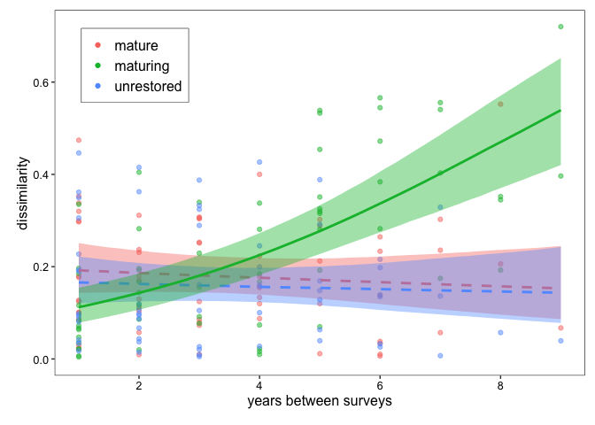
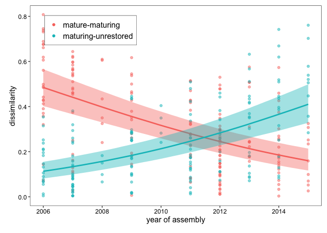
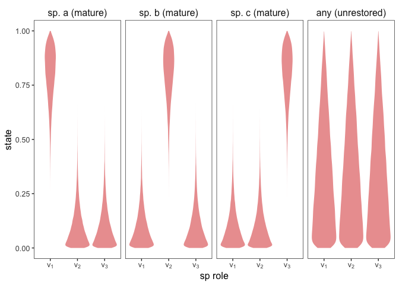
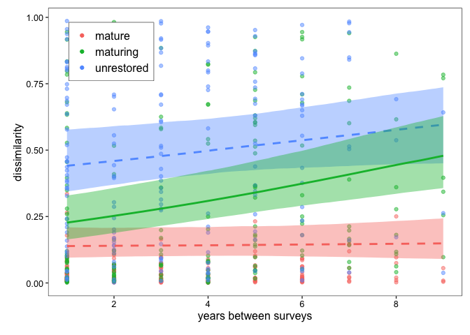
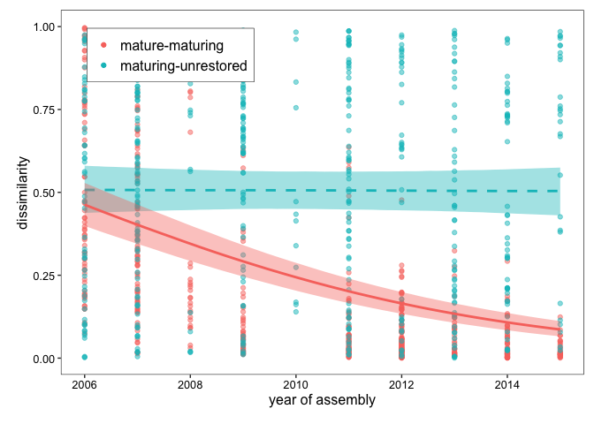

# ecology-species-composition

<!-- badges: start -->
<!-- badges: end -->

This repository describes how to run the models used in the manuscript
*Changes in species composition and community structure during
plant-pollinator community assembly* by Palumbo Gaiarsa et. al.

## Comparing network dissimilarity metrics

The underlying models for Figures 2 and 3 of the manuscript are the
same, and here we will demonstrate how to sample them using
[brms](https://paulbuerkner.com/brms/).

### Generate data

The data used for the models is generated by analyzing many
plant-pollinator networks with
[muritz](https://github.com/stoufferlab/muritz). To showcase the
functionality of the models, however, we will here use simulated data
instead.

The first models analyse different network dissimilarity metrics within
sites and between treatments. We will assume a Clementsian view of
community ecology, where maturing communities progress towards an
optimum community structure. Therefore, we will generate three types of
communities: 10 mature communities, already at the optimum state; 10
maturing communities, progressing towards the optimum state over time;
and, 10 unrestored communities, which should resemble maturing
communities at time $t=2006$. For each of this communities, we will
assume we have 4 time points measures sometime between 2006 and 2015.

``` r
library(dplyr)

n <- 10
nt <- 4
mu_ <- c(0.25, 0.75)

d <- data.frame(treatment = c(rep("mature", n), rep("maturing", n), rep("unrestored", n)),
                site = paste0("site", 1:(n*3))) %>%
  group_by(treatment, site) %>%
  reframe(time = sort(sample(2006:2015, replace = F, size = nt)))
```

Now, we will assume that the state of a community is defined by a
one-dimensional variable with values between 0 and 1, where the mature
optimum state falls somewhere around 0.75, the unrestored state fall
somewhere around 0.25, and the maturing communities resemble unrestored
communities at $t=2006$ and mature communities at $2015$. For example,
the distributions for the state of the different communities could look
something like:

``` r
library(ggplot2)
library(tidyr)
source("code/utility.R")

phi <- 10
crossing(mu = mu_) %>% 
  expand(nesting(mu),
         beta = seq(from = .001, to = .999, length.out = 300)) %>%
  mutate(d   = dbeta(beta, shape1 = mu * phi, shape2 = phi - (mu * phi))) %>%
  ungroup() %>%
  mutate(mu = factor(mu,
                      levels = mu_,
                      labels = c("unrestored and maturing at t=0", "mature"))) %>%
  ggplot(aes(x = beta, y = d)) +
  geom_area(fill = "#d73027", alpha = 0.5) +
  scale_x_continuous(breaks = 0:2 / 2, labels = c("0", ".5", "1")) +
  scale_y_continuous("density", breaks = NULL) +
  coord_cartesian(ylim = c(0, 14)) +
  xlab("state") +
  facet_grid(~ mu) +
  theme_bw() +
  theme(panel.grid = element_blank(), 
        text = element_text(size=fontsize),
        strip.background = element_blank(),
        strip.text = element_text(size = fontsize))
```


Based on this, we can now generate the values for the mature communities
(fluctuating around the optimal state), the values for unrestored
communities (fluctuating around their unrestored state), and the values
for maturing communities from t=2006 to t=2015.

``` r

slope <- (mu_[2]-mu_[1])/(2015-2006)

d <- d %>%
  ungroup() %>% rowwise() %>%
  mutate(state = case_when(
    treatment == "maturing" ~ rbeta(1, shape1 = (mu_[1] + slope * (time-2006)) * phi,
                                    shape2 = phi - ((mu_[1] + slope * (time-2006)) * phi)),
    treatment == "unrestored" ~ rbeta(1, shape1 = mu_[1] * phi, shape2 = phi - (mu_[1] * phi)),
    treatment == "mature" ~ rbeta(1, shape1 = mu_[2] * phi, shape2 = phi - (mu_[2] * phi))
  )) %>% dplyr::select(treatment, site, time, state)
```

Finally, a convenient table to estimate the dissimilarity between any
two time points is a table with every combination of site-time points.

``` r

cbn <- combn(1:nrow(d),2)

dissimilarity <- cbind(
  d[cbn[1,],] %>% rename_at(vars(colnames(d)), ~ paste0(colnames(d), "A")),
  d[cbn[2,],] %>% rename_at(vars(colnames(d)), ~ paste0(colnames(d), "B"))
) %>%
  mutate(dissimilarity = abs(stateA-stateB))
```

### Within site

Once we have the data, we need to prepare it for the analysis. We want
to study how dissimilarity for a given site increases or decreases as
time between sites increases. Therefore, we need to filter the
dissimilarity dataframe accordingly.

``` r
dat <- dissimilarity %>%
  dplyr::filter(siteA == siteB & timeA != timeB) %>%
  mutate(timediff = abs(timeA-timeB))
```

Before running the models, we should rescale the explanatory and
response variable to help the sampling of the models. First, to avoid
the response variable to include zeros and ones, we follow Smithson and
Verkuilen (Psychological Methods, 2006;
doi.org/10.1037/1082-989X.11.1.54). Second, we also rescale the response
variable to have mean 0 and variance 1.

``` r
xstd <- scale(dat$timediff)
dat$x <- xstd
dat$y <- (dat$dissimilarity*(nrow(dat)-1) + 0.5)/nrow(dat)
```

Then we can run the model with brms.

``` r

library(brms)
library(tidybayes)
library(modelr)

modpriors <- c(prior_string("normal(0,1)", class = "b"),
                 prior_string("gamma(0.01, 0.01)", class = "phi"),
                 prior_string("student_t(3, 0, 2.5)", class = "sd"))

mod1 <- brm(y ~  0 + treatmentA + x:treatmentA + (1 | siteA), data=dat, family="beta",
              prior = modpriors, cores = 4, chains = 4, iter = 3000, warmup = 1000,
              file="./results/within_site",
              file_refit = getOption("brms.file_refit", "on_change"))
```

And then generate a figure replicating Figure 2a and 3a of the main
text.

``` r

sig <- summary(mod1)
hardline <- rownames(sig$fixed[sig$fixed$`l-95% CI` * sig$fixed$`u-95%` > 0,])
hardline <- gsub("^treatmentA", "", gsub(":x", "", hardline[grepl(":x", hardline)]))

(dat %>%
    group_by(treatmentA) %>%
    data_grid(x = seq(from=min(xstd),to=max(xstd), length.out = 100)) %>%
    mutate(newx=x*attr(xstd, "scaled:scale") + attr(xstd, "scaled:center")) %>%
    add_fitted_draws(mod1, re_formula = NA) %>%
    median_qi(ynew = .value, .width = .95) %>%
    mutate(significance = (as.character(treatmentA) %in% hardline)*1) %>%
    ggplot(aes(x=newx, y=ynew, id=as.factor(treatmentA),
               color=as.factor(treatmentA), fill=as.factor(treatmentA)))+
    geom_point(data = dat,
               aes(x=timediff,y=y,color=as.factor(treatmentA),fill=as.factor(treatmentA),
                   id=as.factor(treatmentA)),
               show.legend = T, alpha=0.5)+
    geom_smooth(
      aes(ymin = .lower, ymax=.upper, linetype=as.factor(significance)), 
      stat = "identity", show.legend = F,) +
    coord_trans(xlim=c(min(dat$timediff), max(dat$timediff)), ylim=c(0, max(dat$y))) +
    xlab("years between surveys")+ylab("dissimilarity")) %>%
    add_theme()
```



### Between treatments

Now, we want to study how dissimilarity between treatments changes over
time. Therefore, we need to again filter the dissimilarity dataframe,
and rescale the variables.

``` r
dat <- dissimilarity %>%
  dplyr::filter(treatmentA != treatmentB & timeA == timeB) %>%
  rowwise() %>%
  mutate(treatment = paste(sort(c(treatmentA, treatmentB)), collapse = "-")) %>%
  dplyr::filter(treatment != "mature-unrestored")

xstd <- scale(dat$timeA)
dat$x <- xstd
dat$y <- (dat$dissimilarity*(nrow(dat)-1) + 0.5)/nrow(dat)
```

Then we can run the model with brms.

``` r

modpriors <- c(prior_string("normal(0,1)", class = "b"),
                 prior_string("gamma(0.01, 0.01)", class = "phi"),
                 prior_string("student_t(3, 0, 2.5)", class = "sd"))

mod1 <- brm(y ~  0 + treatment + x:treatment + (1 | siteA) + (1 | siteB), data=dat, family="beta",
              prior = modpriors, cores = 4, chains = 4, iter = 3000, warmup = 1000,
              file="./results/between_treatments",
              file_refit = getOption("brms.file_refit", "on_change"))
```

And then generate a figure replicating Figure 2b and 3b of the main
text.

``` r

sig <- summary(mod1)
hardline <- rownames(sig$fixed[sig$fixed$`l-95% CI` * sig$fixed$`u-95%` > 0,])
hardline <- gsub("^treatment", "", gsub(":x", "", hardline[grepl(":x", hardline)]))

(dat %>%
    group_by(treatment) %>%
    data_grid(x = seq(from=min(xstd),to=max(xstd), length.out = 100)) %>%
    mutate(newx=x*attr(xstd, "scaled:scale") + attr(xstd, "scaled:center")) %>%
    add_fitted_draws(mod1, re_formula = NA) %>%
    median_qi(ynew = .value, .width = .95) %>%
    mutate(significance = (gsub("-", "M",as.character(treatment)) %in% hardline)*1) %>%
    ggplot(aes(x=newx, y=ynew, id=as.factor(treatment),
               color=as.factor(treatment), fill=as.factor(treatment)))+
    geom_point(data = dat,
               aes(x=timeA,y=y,color=as.factor(treatment),fill=as.factor(treatment),
                   id=as.factor(treatment)),
               show.legend = T, alpha=0.5)+
    geom_smooth(aes(ymin = .lower, ymax=.upper, linetype=as.factor(significance)),
                stat = "identity", show.legend = F,)+
    coord_trans(xlim=c(min(dat$timeA), max(dat$timeA)), ylim=c(0, max(dat$y)))+
    xlab("year of assembly")+ylab("dissimilarity")) %>%
  add_theme()
```



## Comparing species role dissimilarity

The code for the rest of the figures, such as figure 4 in the main text,
it is for the most part really similar to that of the previous figures.
The only difference is that we are here comparing the roles for
individual species within each network.

### Generate data

Species’ roles are based on the definition of network motifs, and for
each empirical network, these are calculated with
[pymfinder](https://github.com/stoufferlab/muritz). To showcase the
functionality of the models, however, we will here use simulated data
instead.

Imagine that every network from the exercise before has now three
species $a$, $b$, and $c$.

``` r

d_spp <- d %>% rowwise() %>%
  reframe(sp = c("a", "b", "c"), across())
```

Then, let’s assume that the role of a species is defined by a
three-dimensional vector $\vec{v}$. Analogously to the case of the state
of a network, we want species roles for mature and unrestored
communities to look different, and we want the roles for species in
maturing communities to transition from the unrestored to the mature
case. We can do this by simulating those roles using a Dirichlet
distribution, such that the roles look something like:

``` r
library(LaplacesDemon)

rbind(
  data.frame(rdirichlet(1e5, c(8,1,1)), case="sp. a (mature)"),
  data.frame(rdirichlet(1e5, c(1,8,1)), case="sp. b (mature)"),
  data.frame(rdirichlet(1e5, c(1,1,8)), case="sp. c (mature)"),
  data.frame(rdirichlet(1e5, c(1,1,1)), case="any (unrestored)")
  ) %>%
  pivot_longer(!case, names_to = "dim", values_to = "dens") %>%
  ggplot(aes(x = dim, y = dens)) +
  geom_violin(fill = "#d73027", alpha = 0.5, colour = NA) +
  scale_x_discrete(labels = c(expression(v[1]), expression(v[2]),  expression(v[3]))) +
  scale_y_continuous("state") +
  xlab("sp role") +
  facet_grid(~ 
          factor(case,
              levels = c("sp. a (mature)", "sp. b (mature)", "sp. c (mature)", "any (unrestored)"))
          ) +
  theme_bw() +
  theme(panel.grid = element_blank(), 
        text = element_text(size=fontsize),
        strip.background = element_blank(),
        strip.text = element_text(size = fontsize))
```



Based on this, we can now simulate the data just like we did for the
networks. That is, species in unrestored and mature follow the figure
above, and maturing species start as unrestored, and transition to
mature species.

``` r

slope <- (8-1)/(2015-2006)

d_spp <- d_spp %>%
  ungroup() %>% rowwise() %>%
  mutate(v1 = case_when(
    treatment=="mature" && sp=="a" ~ 8,
    treatment=="maturing" && sp=="a" ~ 1 + slope * (time-2006),
    TRUE ~ 1
  )) %>%
  mutate(v2 = case_when(
    treatment=="mature" && sp=="b" ~ 8,
    treatment=="maturing" && sp=="b" ~ 1 + slope * (time-2006),
    TRUE ~ 1
  )) %>%
  mutate(v3 = case_when(
    treatment=="mature" && sp=="c" ~ 8,
    treatment=="maturing" && sp=="c" ~ 1 + slope * (time-2006),
    TRUE ~ 1
  ))

d_spp[,c("v1", "v2", "v3")] <- rdirichlet(nrow(d_spp), alpha = as.matrix(d_spp[,c("v1", "v2", "v3")]))
```

Much like with the case of network dissimilarity, we can now calculate
the dissimilarity between any two species at any time point and network.
We will define the dissimilarity metric as $d=\frac{1-\rho}{2}$, where
$\rho$ is the Pearson’s correlation between species role. Notice,
however, that we will use the state of the network, defined for the
previous figures, as element $v_0$ of species roles, to include overall
network differences as part of the definiton of a role.

``` r

d_spp <- d_spp %>% rename(v0 = state)

cbn <- combn(1:nrow(d_spp),2)

dissimilarity_spp <- cbind(
  d_spp[cbn[1,],] %>% rename_at(vars(colnames(d_spp)), ~ paste0(colnames(d_spp), "A")),
  d_spp[cbn[2,],] %>% rename_at(vars(colnames(d_spp)), ~ paste0(colnames(d_spp), "B"))
) %>%
  rowwise() %>%
  mutate(dissimilarity = 0.5*(1-cor(c(v0A, v1A, v2A, v3A), c(v0B, v1B, v2B, v3B))))
```

### Within site

Once we have the data, we need to prepare it for the analysis. We want
to study how dissimilarity for a given site increases or decreases as
time between sites increases. Therefore, we need to filter the
dissimilarity dataframe accordingly, and rescale the variables.

``` r
dat_spp <- dissimilarity_spp %>%
  dplyr::filter(siteA == siteB & timeA != timeB & spA == spB) %>%
  mutate(timediff = abs(timeA-timeB))

xstd <- scale(dat_spp$timediff)
dat_spp$x <- xstd
dat_spp$y <- (dat_spp$dissimilarity*(nrow(dat_spp)-1) + 0.5)/nrow(dat_spp)
```

Then we can run the model with brms.

``` r

modpriors <- c(prior_string("normal(0,1)", class = "b"),
                 prior_string("gamma(0.01, 0.01)", class = "phi"),
                 prior_string("student_t(3, 0, 2.5)", class = "sd"))

mod1 <- brm(y ~  0 + treatmentA + x:treatmentA + (1 | siteA) + (1 | spA), data=dat_spp, family="beta",
              prior = modpriors, cores = 4, chains = 4, iter = 3000, warmup = 1000,
              file="./results/within_site_roles",
              file_refit = getOption("brms.file_refit", "on_change"))
```

And then generate a figure replicating Figure 4a of the main text.

``` r

sig <- summary(mod1)
hardline <- rownames(sig$fixed[sig$fixed$`l-95% CI` * sig$fixed$`u-95%` > 0,])
hardline <- gsub("^treatmentA", "", gsub(":x", "", hardline[grepl(":x", hardline)]))

(dat_spp %>%
    group_by(treatmentA) %>%
    data_grid(x = seq(from=min(xstd),to=max(xstd), length.out = 100)) %>%
    mutate(newx=x*attr(xstd, "scaled:scale") + attr(xstd, "scaled:center")) %>%
    add_fitted_draws(mod1, re_formula = NA) %>%
    median_qi(ynew = .value, .width = .95) %>%
    mutate(significance = (as.character(treatmentA) %in% hardline)*1) %>%
    ggplot(aes(x=newx, y=ynew, id=as.factor(treatmentA),
               color=as.factor(treatmentA), fill=as.factor(treatmentA)))+
    geom_point(data = dat_spp,
               aes(x=timediff,y=y,color=as.factor(treatmentA),fill=as.factor(treatmentA),
                   id=as.factor(treatmentA)),
               show.legend = T, alpha=0.5)+
    geom_smooth(
      aes(ymin = .lower, ymax=.upper, linetype=as.factor(significance)), 
      stat = "identity", show.legend = F,) +
    coord_trans(xlim=c(min(dat_spp$timediff), max(dat_spp$timediff)), ylim=c(0, max(dat_spp$y))) +
    xlab("years between surveys")+ylab("dissimilarity")) %>%
    add_theme()
```



### Between treatments

Similarly, we can study how dissimilarity between treatments changes
over time. Therefore, as we did for the network dissimilarity, we need
to filter the dissimilarity dataframe, and rescale the variables.

``` r
dat_spp <- dissimilarity_spp %>%
  dplyr::filter(treatmentA != treatmentB & timeA == timeB & spA == spB) %>%
  rowwise() %>%
  mutate(treatment = paste(sort(c(treatmentA, treatmentB)), collapse = "-")) %>%
  dplyr::filter(treatment != "mature-unrestored")

xstd <- scale(dat_spp$timeA)
dat_spp$x <- xstd
dat_spp$y <- (dat_spp$dissimilarity*(nrow(dat_spp)-1) + 0.5)/nrow(dat_spp)
```

Then we can run the model with brms.

``` r

modpriors <- c(prior_string("normal(0,1)", class = "b"),
                 prior_string("gamma(0.01, 0.01)", class = "phi"),
                 prior_string("student_t(3, 0, 2.5)", class = "sd"))

mod1 <- brm(y ~  0 + treatment + x:treatment + (1 | siteA) + (1 | siteB), data=dat_spp, family="beta",
              prior = modpriors, cores = 4, chains = 4, iter = 3000, warmup = 1000,
              file="./results/between_treatments_roles",
              file_refit = getOption("brms.file_refit", "on_change"))
```

And then generate a figure replicating Figure 4b of the main text

``` r

sig <- summary(mod1)
hardline <- rownames(sig$fixed[sig$fixed$`l-95% CI` * sig$fixed$`u-95%` > 0,])
hardline <- gsub("^treatment", "", gsub(":x", "", hardline[grepl(":x", hardline)]))

(dat_spp %>%
    group_by(treatment) %>%
    data_grid(x = seq(from=min(xstd),to=max(xstd), length.out = 100)) %>%
    mutate(newx=x*attr(xstd, "scaled:scale") + attr(xstd, "scaled:center")) %>%
    add_fitted_draws(mod1, re_formula = NA) %>%
    median_qi(ynew = .value, .width = .95) %>%
    mutate(significance = (gsub("-", "M",as.character(treatment)) %in% hardline)*1) %>%
    ggplot(aes(x=newx, y=ynew, id=as.factor(treatment),
               color=as.factor(treatment), fill=as.factor(treatment)))+
    geom_point(data = dat_spp,
               aes(x=timeA,y=y,color=as.factor(treatment),fill=as.factor(treatment),
                   id=as.factor(spA)),
               show.legend = T, alpha=0.5)+
    geom_smooth(aes(ymin = .lower, ymax=.upper, linetype=as.factor(significance)),
                stat = "identity", show.legend = F,)+
    coord_trans(xlim=c(min(dat_spp$timeA), max(dat_spp$timeA)), ylim=c(0, 1))+
    xlab("year of assembly")+ylab("dissimilarity")) %>%
  add_theme()
```



Note that one would expect the line for the ‘maturing-unrestored’
treatment to have a slope that is consistently above zero under a
Clementsian view of community ecology. However, our choice of roles for
unrestored makes them very variable, and we would need many more species
for the averages to show a trend.
